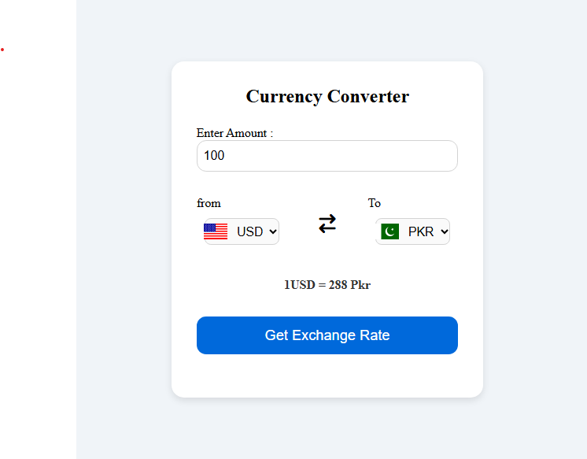

# 💱 Currency Converter App

A simple **Currency Converter Web Application** that allows users to convert between different currencies using real-time exchange rates. Built with **HTML, CSS, and JavaScript**.

---

## 🚀 Features
- Convert any amount between two selected currencies  
- Fetches **live exchange rates** from [ExchangeRate API](https://www.exchangerate-api.com/)  
- Default conversion: **USD → PKR**  
- Country **flags update automatically** when you change currencies  
- Modern and responsive design  
- Easy to use on both desktop and mobile devices  

---

## 🛠️ Technologies Used
- **HTML5** – Structure  
- **CSS3** – Styling and Responsive Layout  
- **JavaScript (ES6)** – Functionality & API integration  
- **ExchangeRate API** – Provides live exchange rates  
- **FlagsAPI** – Provides currency country flags  

---

## 📷 Screenshot


---

## 📂 Project Setup
1. Clone the repository:
   ```bash
   git clone https://github.com/umarazlan/CurrencyConverter-by-using-html-css-and-javascript.git

2.Open the project folder:

• cd currency-converter

3.Run the project:

• Simply open index.html in your browser (no server required).

📱 Responsiveness

• Works on desktop, tablet, and mobile

• Dropdowns stack vertically on smaller screens

• Touch-friendly buttons and inputs

⚡ Future Improvements

• Add currency search functionality

• Show historical exchange rate charts

• Save user preferences (default currency selection)

👨‍💻 Author

• Developed by Umar Azlan Khan

📂 𝗙𝗼𝗹𝗱𝗲𝗿 𝗦𝘁𝗿𝘂𝗰𝘁𝘂𝗿𝗲

├── api_project.html              # Main HTML file

├── api_project.css             # styling with css

├── api_project.js          # Main Javascript file

├── screenshot.png      # screenshot of the app
